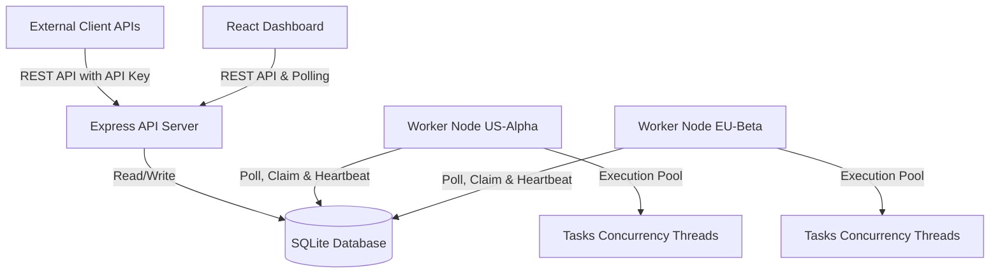
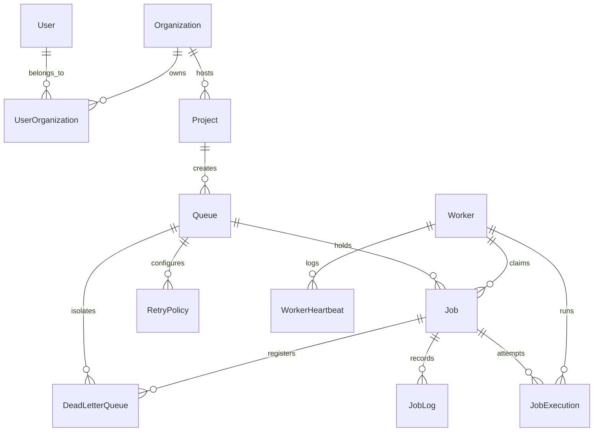

# Joblix: Distributed Job Scheduler

Joblix is a production-inspired, highly concurrent, distributed background job scheduling platform designed to run asynchronous workloads across multiple worker instances. It features user authentication, multi-queue management, complex job lifecycle actions, atomic claims, configurable backoff strategies, a Dead Letter Queue (DLQ), and a premium glassmorphic Light Theme dashboard for real-time orchestration.

---

## System Architecture



---

## Entity-Relationship (ER) Diagram



---

## Core Features & Capabilities

* **Full Job Lifecycle**: Transition tracking across `QUEUED` $\rightarrow$ `SCHEDULED` $\rightarrow$ `CLAIMED` $\rightarrow$ `RUNNING` $\rightarrow$ `COMPLETED` / `FAILED`.
* **Atomic Job Claiming**: Prevents double-claiming of jobs using atomic Prisma transactions.
* **Configurable Retry Policies**: Fixed delay, linear backoff, and exponential backoff calculations.
* **Cron Scheduling**: Native cron parsing (`cron-parser`) to reschedule recurring executions dynamically.
* **Dead Letter Queue (DLQ)**: Automatic isolation of failed runs after max retries are exhausted.
* **AI-Generated Failure Diagnostics**: Simulated AI summaries of stack traces and errors advising developers on mitigation.
* **Worker Heartbeat Tracking**: Monitors active nodes, CPU, and memory profiles.

---

## Setup Instructions

### Prerequisites
* Node.js (v18+)
* npm (v9+)

### Local Development Setup

1. **Clone the repository and install dependencies**:
   ```bash
   # Install Backend dependencies
   cd backend
   npm install

   # Install Frontend dependencies
   cd ../frontend
   npm install
   ```

2. **Configure environment files**:
   Create a `.env` in `backend/` (a default `.env` is already configured for SQLite):
   ```env
   DATABASE_URL="file:./dev.db"
   JWT_SECRET="joblix_super_secret_session_key_987654321"
   PORT=4000
   ```

3. **Initialize the database & seeds**:
   ```bash
   cd backend
   npx prisma db push
   npm run db:seed
   ```

4. **Run Backend services**:
   ```bash
   # Run the API server
   npm run start:server

   # In a new terminal window, run the Worker daemon
   npm run start:worker
   ```

5. **Run Frontend Dashboard**:
   ```bash
   cd frontend
   npm run dev
   ```
   Open `http://localhost:5173` to view the Dashboard. Log in with `admin@joblix.com` / `admin123`.

---

## Docker Compose Setup (Single Command)

You can spin up the entire cluster (API Server, Worker, and Nginx-served static dashboard) using Docker Compose:

```bash
docker-compose up --build
```
* **Frontend Dashboard**: Open `http://localhost:3000`
* **API Server**: Runs on `http://localhost:4000`

---

## Running Automated Tests

To execute the suite verifying concurrency safety, atomic claims, state transitions, backoff math, and DLQ triggers:

```bash
cd backend
npm run test
```

---

## API Documentation

All endpoints require authorization via `Authorization: Bearer <token>`, except login/register, or project actions authenticated via `x-api-key`.

| Endpoint | Method | Description | Payload Example |
|---|---|---|---|
| `/api/auth/register` | `POST` | Registers a new user, org, and project | `{ "email": "a@b.com", "password": "abc", "name": "A" }` |
| `/api/auth/login` | `POST` | Exchanges credentials for JWT token | `{ "email": "a@b.com", "password": "abc" }` |
| `/api/queues` | `GET` | Lists queues and their statistics | |
| `/api/queues` | `POST` | Creates a new job queue | `{ "name": "email-queue", "priority": 3 }` |
| `/api/jobs` | `POST` | Submits a job (immediate, delayed, cron) | `{ "queueName": "email-queue", "payload": { "id": 1 } }` |
| `/api/jobs` | `GET` | Explorer search (filtered, paginated) | |
| `/api/jobs/:id/retry` | `POST` | Re-queues a failed or DLQ job | |
| `/api/jobs/:id/ai-summary` | `GET` | Fetches AI summary for a job failure | |
